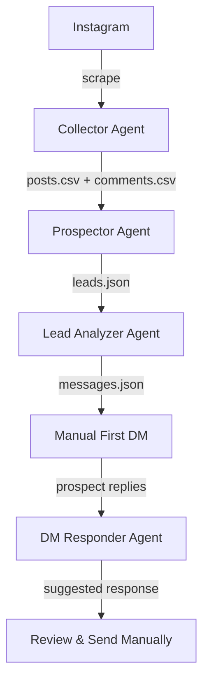

# Instagram Lead Engine - Agent Documentation

Complete reference for all 5 independent agents in the Instagram Lead Engine system.

---

## Table of Contents

1. [Collector Agent](#1-collector-agent)
2. [Prospector Agent](#2-prospector-agent)
3. [Lead Analyzer Agent](#3-lead-analyzer-agent)
4. [DM Responder Agent](#4-dm-responder-agent)
5. [Message Generator Agent](#5-message-generator-agent)
6. [Data Contracts](#data-contracts)
7. [Integration Guide](#integration-guide)

---

## 1. Collector Agent

**Purpose**: Discover Instagram posts and scrape comments from hashtags and competitor profiles.

### Features

- Hashtag post discovery
- Competitor profile post discovery
- Comment extraction with metadata
- Manual login (ToS compliant)
- Anti-detection features (headful, delays, challenge detection)
- Modular CLI with 5 operational modes

### Modes

| Mode | Description | Required Params |
|------|-------------|----------------|
| `hashtags` | Discover from hashtags only | `--hashtags` |
| `profiles` | Discover from profiles only | `--profiles` |
| `both` | Discover from both sources | `--hashtags` or `--profiles` |
| `only-discover` | Discovery without comment scraping | `--hashtags` or `--profiles` |
| `scrape-comments` | Scrape comments from existing posts.csv | `--max-comments` |

### Installation

```bash
cd agents/collector
npm install
npx playwright install chromium
```

### Usage Examples

**Discover from hashtags:**
```bash
node bin/run.js \
  --mode hashtags \
  --hashtags fitness weightloss transformation \
  --max-posts 50 \
  --max-comments 100
```

**Discover from competitor profiles:**
```bash
node bin/run.js \
  --mode profiles \
  --profiles competitor_coach fitness_influencer \
  --max-posts 30
```

**Combined discovery:**
```bash
node bin/run.js \
  --mode both \
  --hashtags fitness \
  --profiles competitor_coach \
  --max-posts 25
```

### Output Files

**posts.csv** - Discovered posts
```csv
source_type,source_name,post_url,post_date,likes,comments_count,caption_excerpt
hashtag,fitness,https://instagram.com/p/ABC123/,2024-01-14T18:30:00.000Z,1234,87,Loving this journey...
```

**comments.csv** - Extracted comments
```csv
post_url,username,profile_url,comment_text,comment_date,followers_estimate
https://instagram.com/p/ABC123/,sarah_fitness,https://instagram.com/sarah_fitness/,How do I start?,2024-01-14T19:00:00.000Z,
```

**context/*.json** - Per-post metadata
```json
{
  "post_url": "https://instagram.com/p/ABC123/",
  "scraped_at": "2024-01-15T14:23:45.678Z",
  "caption": "Full caption text...",
  "likes": "1,234 likes",
  "comments_count": "87"
}
```

### Safety Features

- ✅ Manual login required
- ✅ Headful browser (no headless)
- ✅ Randomized delays (3-7 seconds)
- ✅ Challenge detection & stop
- ✅ Rate limit detection

### Configuration

See `agents/collector/.env.example` for configuration options.

### Limitations

- Requires manual Instagram login
- Subject to Instagram's rate limits
- Selectors may break if Instagram updates UI (see `prompts/selector_notes.md`)

---

## 2. Prospector Agent

**Purpose**: Classify commenters as warm, cold, or irrelevant leads based on their comment text.

### Features

- Natural language analysis of comments
- Pain point extraction
- Goal identification
- Lead scoring (0-100)
- Classification: warm/cold/irrelevant
- Batch processing from CSV

### Installation

```bash
cd agents/prospector
npm install
```

### Usage

```bash
node bin/run.js \
  --input ../collector/output/comments.csv \
  --output leads.json \
  --min-score 60
```

### Classification Criteria

**Warm Leads (70-100)**
- Expresses clear pain points
- Shows high intent/urgency
- Asks qualifying questions
- Engages meaningfully with content

**Cold Leads (40-69)**
- Some interest shown
- Generic engagement
- Low intent signals
- Unclear needs

**Irrelevant (0-39)**
- No clear pain points
- Emoji-only comments
- Off-topic remarks
- Low-quality engagement

### Output Format

**leads.json**
```json
[
  {
    "username": "sarah_fitness23",
    "profile_url": "https://www.instagram.com/sarah_fitness23/",
    "warmth": "warm",
    "score": 85,
    "reasoning": "User expresses clear pain about consistency and shows urgency",
    "pain_points": [
      "Difficulty maintaining consistency",
      "Frustration with lack of results"
    ],
    "goals": [
      "Get in shape",
      "Build sustainable habits"
    ],
    "comment_text": "I've been trying for months but can't stay consistent. Help!",
    "post_url": "https://instagram.com/p/ABC123/",
    "objections_likely": ["Past failures", "Time commitment"],
    "best_approach": "Empathy-first, address pattern of quitting"
  }
]
```

### Scoring Algorithm

```
Base score: 50

+ Pain point mentioned: +15 per unique pain
+ Goal articulated: +10 per goal
+ Question asked: +10
+ Urgency words (now, asap, help): +10
+ Length > 50 chars: +5
- Generic comment: -20
- Emoji only: -30
- Irrelevant topic: -40
```

### Configuration

See `agents/prospector/.env.example` for customization.

---

## 3. Lead Analyzer Agent

**Purpose**: Analyze qualified leads and generate personalized outreach strategies.

### Features

- Customer persona generation
- Top prospect identification (3-5 best)
- Pitch angle creation per prospect
- Message framework templates
- Strategic recommendations

### Installation

```bash
cd agents/lead-analyzer
npm install
```

### Usage

```bash
node bin/run.js \
  --input ../prospector/leads.json \
  --output messages.json \
  --top 5
```

### Output Format

**messages.json**
```json
{
  "persona_summary": {
    "common_pain_points": [
      "Lack of consistency",
      "Previous failures"
    ],
    "common_goals": [
      "Get in shape",
      "Build habits"
    ],
    "demographic_insights": "Ages 25-40, frustrated with quick fixes",
    "best_hooks": [
      "What if you could finally stay consistent?",
      "The real reason transformations fail (hint: it's not discipline)"
    ]
  },
  "top_prospects": [
    {
      "username": "sarah_fitness23",
      "profile_url": "https://instagram.com/sarah_fitness23/",
      "score": 85,
      "warmth": "warm",
      "why_top_prospect": "High urgency, clear pain, engaged with content multiple times",
      "messages": [
        {
          "angle": "empathy_first",
          "script": "Hey Sarah! I saw your comment about struggling with consistency. I get it—that's the #1 thing I hear. Mind if I ask what you've tried so far?",
          "purpose": "rapport"
        },
        {
          "angle": "pain_point_amplification",
          "script": "I totally hear you on the frustration. Can I ask—on a scale of 1-10, how important is solving this to you right now?",
          "purpose": "qualification"
        },
        {
          "angle": "soft_cta",
          "script": "Based on what you shared, I think I can help. Would you be open to a quick 15-min call to see if this could work for you?",
          "purpose": "cta"
        }
      ]
    }
  ]
}
```

### Analysis Process

1. **Aggregate Analysis**: Identify patterns across all leads
2. **Persona Creation**: Build composite customer profile
3. **Ranking**: Score prospects by multiple factors
4. **Strategy Generation**: Create personalized approaches
5. **Message Sequencing**: Build 3-message framework per prospect

### Best Practices

- Review persona summary before outreach
- Customize messages to match your voice
- Don't send all 3 messages at once
- Use as inspiration, not scripts

---

## 4. DM Responder Agent

**Purpose**: Generate contextual follow-up messages for Instagram DM conversations.

### Features

- Conversation state machine (9 stages)
- Intent detection (pain, objection, interest)
- Pain point extraction
- Empathy-first templates
- Qualification question generation
- Objection handling frameworks
- CTA generation

### Installation

```bash
cd agents/dmresponder
npm install
```

### Usage

**Interactive mode (recommended):**
```bash
node bin/run.js --interactive
```

**File mode:**
```bash
node bin/run.js \
  -c conversation_history.json \
  -l lead_context.json \
  -o response.json
```

### Input Format

**conversation_history.json**
```json
[
  {
    "role": "assistant",
    "text": "Hey! I saw your comment. Are you dealing with something similar?"
  },
  {
    "role": "user",
    "text": "Yeah, I've been struggling for months and nothing works."
  }
]
```

### Output Format

**response.json**
```json
{
  "next_message": "I hear you. That's so frustrating when you're putting in effort but not seeing results. Can I ask—what have you tried so far?",
  "conversation_stage": "empathy_building",
  "message_type": "empathy",
  "reasoning": "User expressed frustration and lack of results. Respond with empathy before qualifying.",
  "alternative_approaches": [
    "Ask about their specific situation",
    "Share a relatable story"
  ],
  "next_steps": [
    "Wait for their response",
    "Look for qualification signals",
    "Continue building trust"
  ]
}
```

### Conversation Stages

1. **initial_rapport**: First interaction, building connection
2. **empathy_building**: Validating feelings, showing understanding
3. **qualification**: Assessing fit (timeline, budget, commitment)
4. **objection_handling**: Addressing concerns
5. **value_demonstration**: Showing how you can help
6. **call_to_action**: Suggesting next step
7. **scheduling**: Booking the call
8. **closed_won**: Deal closed
9. **closed_lost**: Not a fit

### Message Types

- **empathy**: Emotional validation
- **qualification**: Fit assessment questions
- **rapport**: Relationship building
- **objection_response**: Concern handling
- **value_prop**: Solution demonstration
- **call_to_action**: Next step suggestion
- **scheduling**: Logistics

### Safety Rules

⚠️ **CRITICAL**:
- Only use AFTER you've sent first manual DM
- Only use AFTER prospect has replied
- ALWAYS review before sending
- NEVER automate sending

---

## 5. Message Generator Agent

**Purpose**: Generate Instagram content ideas (posts, reels, hooks, carousels).

### Features

- 30-60 post ideas based on niche
- Reels scripts with hooks
- Pattern interrupt hooks
- Carousel outlines
- Caption templates
- Hashtag suggestions

### Installation

```bash
cd agents/message-generator
npm install
```

### Usage

```bash
node bin/run.js \
  --niche "fitness coaching" \
  --pain-points "lack of consistency,no motivation,past failures" \
  --count 50 \
  --output content_ideas.json
```

### Output Format

**content_ideas.json**
```json
{
  "niche": "fitness coaching",
  "posts": [
    {
      "type": "value_post",
      "hook": "The real reason you can't stay consistent (it's not discipline)",
      "caption": "Everyone thinks consistency is about willpower. But here's the truth...",
      "cta": "Save this for later",
      "hashtags": ["#fitness", "#consistency", "#motivation"]
    }
  ],
  "reels": [
    {
      "hook": "POV: You finally figured out the consistency secret",
      "script": "Here's what changed everything for me...",
      "scenes": ["Scene 1: Problem", "Scene 2: Realization", "Scene 3: Solution"],
      "duration": "30-45 seconds"
    }
  ],
  "carousels": [
    {
      "title": "5 Mistakes Killing Your Consistency",
      "slides": [
        "Slide 1: Intro",
        "Slide 2-6: Each mistake",
        "Slide 7: CTA"
      ]
    }
  ]
}
```

### Content Types

- **Value Posts**: Educational, problem-solving
- **Story Posts**: Personal, relatable
- **Engagement Posts**: Questions, polls
- **Authority Posts**: Results, testimonials
- **Reels**: Short-form video scripts
- **Carousels**: Multi-slide educational

---

## Data Contracts

### posts.csv

**Columns**: `source_type`, `source_name`, `post_url`, `post_date`, `likes`, `comments_count`, `caption_excerpt`

**Example**:
```csv
source_type,source_name,post_url,post_date,likes,comments_count,caption_excerpt
hashtag,fitness,https://instagram.com/p/ABC/,2024-01-14T18:30:00.000Z,1234,87,Loving this journey...
```

### comments.csv

**Columns**: `post_url`, `username`, `profile_url`, `comment_text`, `comment_date`, `followers_estimate`

**Example**:
```csv
post_url,username,profile_url,comment_text,comment_date,followers_estimate
https://instagram.com/p/ABC/,sarah,https://instagram.com/sarah/,How do I start?,2024-01-14T19:00:00.000Z,
```

### leads.json

**Structure**:
```json
[
  {
    "username": "string",
    "profile_url": "string",
    "warmth": "warm|cold|irrelevant",
    "score": 0-100,
    "reasoning": "string",
    "pain_points": ["string"],
    "goals": ["string"],
    "comment_text": "string",
    "post_url": "string",
    "objections_likely": ["string"],
    "best_approach": "string"
  }
]
```

### messages.json

**Structure**:
```json
{
  "persona_summary": {
    "common_pain_points": ["string"],
    "common_goals": ["string"],
    "demographic_insights": "string",
    "best_hooks": ["string"]
  },
  "top_prospects": [
    {
      "username": "string",
      "messages": [
        {
          "angle": "string",
          "script": "string",
          "purpose": "rapport|pain_point|cta"
        }
      ]
    }
  ]
}
```

### conversation_history.json

**Structure**:
```json
[
  {
    "role": "user|assistant",
    "text": "string"
  }
]
```

### response.json

**Structure**:
```json
{
  "next_message": "string",
  "conversation_stage": "string",
  "message_type": "string",
  "reasoning": "string",
  "alternative_approaches": ["string"],
  "next_steps": ["string"]
}
```

---

## Integration Guide

### Full Workflow



### Step-by-Step Integration

**1. Data Collection**
```bash
cd agents/collector
node bin/run.js --mode both --hashtags fitness --profiles competitor
```

**2. Lead Qualification**
```bash
cd agents/prospector
node bin/run.js -i ../collector/output/comments.csv -o leads.json
```

**3. Strategic Analysis**
```bash
cd agents/lead-analyzer
node bin/run.js -i ../prospector/leads.json -o messages.json --top 5
```

**4. Manual Outreach**
- Review `messages.json`
- Manually send first DM to top prospects
- DO NOT automate this step

**5. Conversation Management**
```bash
cd agents/dmresponder
node bin/run.js --interactive
# Paste prospect's reply, get suggested response
```

**6. Content Creation (Optional)**
```bash
cd agents/message-generator
node bin/run.js --niche "fitness" --pain-points "consistency" --count 30
```

### Automation Considerations

**Safe to Automate**:
- ✅ Data collection (with rate limits)
- ✅ Lead classification
- ✅ Analysis and scoring
- ✅ Response generation (for review)

**NEVER Automate**:
- ❌ First message sending
- ❌ DM replies without human review
- ❌ Any outreach without personalization

### Error Handling

All agents follow consistent error handling:

- Exit code 0: Success
- Exit code 1: User error (invalid params, missing files)
- Exit code 2: System error (network, parsing)
- Errors logged to stderr
- Debug mode available via `DEBUG=true` env var

### Testing Integration

```bash
# Test each agent independently
cd agents/collector && npm test
cd agents/dmresponder && npm test
# etc.

# Test data flow with sample files
cd agents/prospector
node bin/run.js -i ../collector/samples/comments.csv -o test_leads.json

cd agents/lead-analyzer
node bin/run.js -i test_leads.json -o test_messages.json
```

---

## Support & Resources

- **Individual Agent READMEs**: Each agent has detailed documentation
- **Sample Files**: Check `samples/` folders for examples
- **Schemas**: See `schemas/` for data validation
- **Troubleshooting**: Check each agent's README

**Questions?** Open an issue on GitHub.

---

**Last Updated**: 2024-01-15  
**Version**: 1.0.0
