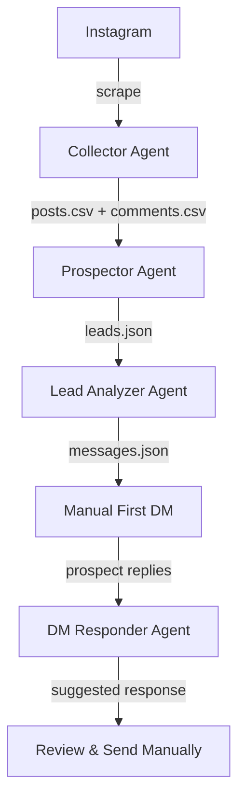

# Instagram Lead Engine - Agent Documentation

**For OpenCode AI Assistant**: This document explains the architecture, coding patterns, and conventions used in this project to help you understand and contribute effectively.

---

## Table of Contents

1. [Project Overview](#project-overview)
2. [Architecture & Design Patterns](#architecture--design-patterns)
3. [Coding Conventions](#coding-conventions)
4. [Agent Structure](#agent-structure)
5. [How to Add a New Agent](#how-to-add-a-new-agent)
6. [Individual Agents](#individual-agents)
7. [Data Contracts](#data-contracts)
8. [Integration Guide](#integration-guide)

---

## Project Overview

The Instagram Lead Engine is a **modular multi-agent system** for ethical Instagram lead generation. Each agent is:

- **Completely independent**: No inter-agent dependencies
- **Self-contained**: Own CLI, tests, and documentation
- **Composable**: Can be used standalone or as part of a pipeline
- **Production-ready**: Error handling, validation, and safety features

### Tech Stack

- **Runtime**: Node.js 18+
- **Module System**: ESM (ES Modules) - `import/export` syntax
- **CLI Framework**: Commander.js for argument parsing
- **Browser Automation**: Playwright (Collector agent only)
- **Data Formats**: CSV for tabular data, JSON for structured data
- **Testing**: Node.js native test runner or Jest

### Key Design Decisions

1. **Why ESM?** Modern JavaScript, better tree-shaking, native browser compatibility
2. **Why independent agents?** Allows selling/deploying individually, easier maintenance
3. **Why CSV for collection?** Universal format, easy to inspect/import
4. **Why JSON for analysis?** Rich structured data, easy to parse programmatically
5. **Why no database?** Simplicity, portability, no deployment dependencies

---

## Architecture & Design Patterns

### 1. Agent Independence Pattern

Each agent follows this structure:

```
agents/[agent-name]/
├── bin/
│   └── run.js          # CLI entry point
├── src/
│   ├── index.js        # Main agent logic
│   ├── config.js       # Configuration constants
│   └── utils.js        # Helper functions
├── tests/
│   └── [agent].test.js # Unit tests
├── samples/            # Example input/output files
├── .env.example        # Environment variables template
├── manifest.json       # Agent metadata
├── package.json        # Dependencies
└── README.md           # Agent-specific documentation
```

### 2. Data Flow Pattern

Agents communicate **only through files** (never through APIs or shared state):

```
Input File → Agent Process → Output File → Next Agent
```

Example:
```
comments.csv → [Prospector] → leads.json → [Lead Analyzer] → messages.json
```

### 3. Error Handling Pattern

All agents follow consistent error handling:

```javascript
// Exit codes
process.exit(0);  // Success
process.exit(1);  // User error (bad params, missing files)
process.exit(2);  // System error (network, parsing)

// Error logging
console.error('ERROR:', message);  // To stderr
console.log('INFO:', message);     // To stdout
```

### 4. Configuration Pattern

Configuration is loaded in this priority order:

1. CLI arguments (highest priority)
2. Environment variables (.env)
3. Defaults from config.js

```javascript
// Example
const maxPosts = 
  args.maxPosts ||           // CLI arg
  process.env.MAX_POSTS ||   // .env
  CONFIG.DEFAULT_MAX_POSTS;  // Default
```

### 5. Validation Pattern

Input validation happens at entry points:

```javascript
import { validators } from '../../shared/validators.js';

// Validate before processing
validators.validatePostUrl(url);
validators.validateUsername(username);
```

Shared validators are in `shared/validators.js` to ensure consistency.

---

## Coding Conventions

### JavaScript Style

**Module System**:
- ✅ Use ESM: `import/export`
- ❌ Don't use CommonJS: `require/module.exports`

**Async Pattern**:
- ✅ Use `async/await`
- ❌ Don't use callbacks or raw Promises

**Function Style**:
- ✅ Named functions for better stack traces
- ✅ Arrow functions for short callbacks
- ❌ Don't use anonymous `function() {}` syntax

```javascript
// ✅ Good
export async function generateResponse({ conversationHistory }) {
  const result = await processData();
  return result;
}

// ❌ Bad
exports.generateResponse = function(params, callback) {
  processData().then(result => callback(null, result));
}
```

### Naming Conventions

**Variables & Functions**: camelCase
```javascript
const maxComments = 100;
function extractPainPoints() {}
```

**Constants**: UPPER_SNAKE_CASE
```javascript
const MAX_RETRIES = 3;
const API_ENDPOINT = 'https://api.example.com';
```

**Classes**: PascalCase
```javascript
class StateMachine {}
```

**Files**: kebab-case.js
```
scrape-post.js
state-machine.js
utils.js
```

**Exported Objects**: PascalCase for singletons
```javascript
export const CONFIG = { ... };
export const WARMTH = { ... };
```

### Code Structure

**Imports Order**:
```javascript
// 1. Node built-ins
import { readFileSync } from 'fs';
import { join } from 'path';

// 2. External dependencies
import { chromium } from 'playwright';
import { Command } from 'commander';

// 3. Internal modules
import { CONFIG } from './config.js';
import { sanitize } from './utils.js';

// 4. Shared modules
import { validators } from '../../shared/validators.js';
```

**Function Organization**:
```javascript
// 1. Main exported functions
export async function mainFunction() {}

// 2. Helper functions (not exported)
function helperFunction() {}
function anotherHelper() {}

// 3. Utility functions at bottom
function sortByDate() {}
function formatOutput() {}
```

### Comments & Documentation

**Use JSDoc for public functions**:
```javascript
/**
 * Generate response for a conversation
 * 
 * @param {Object} params
 * @param {Array} params.conversationHistory - Array of {role, text} objects
 * @param {Object} params.leadContext - Optional lead data from prospector
 * @returns {Promise<Object>} Response object with next_message, stage, reasoning
 */
export async function generateResponse({ conversationHistory, leadContext }) {
  // Implementation
}
```

**Inline comments for complex logic**:
```javascript
// FIX NOTE: Instagram may change selectors - see prompts/selector_notes.md
const SELECTORS = {
  POST_LINK: 'article a[href*="/p/"]'
};

// Wait random delay to avoid rate limits (3-7 seconds)
await page.waitForTimeout(randomDelay());
```

### File Handling

**Use async file operations**:
```javascript
import { readFile, writeFile } from 'fs/promises';

// ✅ Good
const data = await readFile('file.json', 'utf-8');

// ❌ Bad
const data = readFileSync('file.json', 'utf-8');
```

**Always handle errors**:
```javascript
try {
  const data = await readFile('file.json', 'utf-8');
  return JSON.parse(data);
} catch (error) {
  if (error.code === 'ENOENT') {
    console.error('ERROR: File not found:', error.path);
    process.exit(1);
  }
  throw error;
}
```

---

## Agent Structure

### Standard Agent Template

Every agent should follow this template:

**bin/run.js** - CLI entry point:
```javascript
#!/usr/bin/env node

import { Command } from 'commander';
import { runAgent } from '../src/index.js';

const program = new Command();

program
  .name('agent-name')
  .description('Agent description')
  .option('-i, --input <file>', 'Input file path')
  .option('-o, --output <file>', 'Output file path')
  .parse();

try {
  await runAgent(program.opts());
  process.exit(0);
} catch (error) {
  console.error('ERROR:', error.message);
  process.exit(1);
}
```

**src/index.js** - Main logic:
```javascript
import { CONFIG } from './config.js';
import { validateInput } from './utils.js';

export async function runAgent(options) {
  // 1. Validate input
  validateInput(options);
  
  // 2. Load data
  const data = await loadData(options.input);
  
  // 3. Process
  const results = await process(data);
  
  // 4. Save output
  await saveOutput(results, options.output);
  
  return results;
}

async function loadData(inputPath) { /* ... */ }
async function process(data) { /* ... */ }
async function saveOutput(results, outputPath) { /* ... */ }
```

**src/config.js** - Configuration:
```javascript
export const CONFIG = {
  DEFAULT_INPUT: './input/data.json',
  DEFAULT_OUTPUT: './output/results.json',
  MAX_RETRIES: 3,
  TIMEOUT: 30000
};
```

**src/utils.js** - Utilities:
```javascript
import { validators } from '../../shared/validators.js';

export function validateInput(options) {
  if (!options.input) {
    throw new Error('Input file required');
  }
}

export function sanitizeOutput(data) {
  // Remove sensitive data, format output
  return data;
}
```

---

## How to Add a New Agent

Follow these steps to create a new agent:

### 1. Create Directory Structure

```bash
mkdir -p agents/new-agent/{bin,src,tests,samples}
cd agents/new-agent
```

### 2. Initialize Package

```bash
npm init -y
```

Edit `package.json`:
```json
{
  "name": "@instagram-lead-engine/new-agent",
  "version": "1.0.0",
  "type": "module",
  "main": "src/index.js",
  "bin": {
    "new-agent": "./bin/run.js"
  },
  "scripts": {
    "start": "node bin/run.js",
    "test": "node --test tests/"
  },
  "dependencies": {
    "commander": "^11.0.0"
  }
}
```

### 3. Create manifest.json

```json
{
  "name": "New Agent",
  "version": "1.0.0",
  "description": "Brief description",
  "author": "Your Name",
  "input": {
    "type": "json|csv",
    "schema": "schemas/input.schema.json"
  },
  "output": {
    "type": "json|csv",
    "schema": "schemas/output.schema.json"
  }
}
```

### 4. Create Core Files

Follow the [Agent Template](#standard-agent-template) above.

### 5. Create Tests

```javascript
// tests/new-agent.test.js
import { test } from 'node:test';
import assert from 'node:assert';
import { runAgent } from '../src/index.js';

test('should process valid input', async () => {
  const result = await runAgent({ input: 'samples/valid.json' });
  assert.ok(result);
});
```

### 6. Add Sample Files

Create example input/output in `samples/`:
- `input_example.json`
- `output_example.json`

### 7. Write Documentation

Create `README.md` with:
- Purpose
- Installation
- Usage examples
- Input/output formats
- Configuration options

### 8. Update Root Documentation

Add agent to:
- Main `README.md`
- This `AGENTS.md` file
- `PROJECT_FILES.md`

---

## Individual Agents

---

## 1. Collector Agent

**Purpose**: Discover Instagram posts and scrape comments from hashtags and competitor profiles.

### Features

- Hashtag post discovery
- Competitor profile post discovery
- Comment extraction with metadata
- Manual login (ToS compliant)
- Anti-detection features (headful, delays, challenge detection)
- Modular CLI with 5 operational modes

### Modes

| Mode | Description | Required Params |
|------|-------------|----------------|
| `hashtags` | Discover from hashtags only | `--hashtags` |
| `profiles` | Discover from profiles only | `--profiles` |
| `both` | Discover from both sources | `--hashtags` or `--profiles` |
| `only-discover` | Discovery without comment scraping | `--hashtags` or `--profiles` |
| `scrape-comments` | Scrape comments from existing posts.csv | `--max-comments` |

### Installation

```bash
cd agents/collector
npm install
npx playwright install chromium
```

### Usage Examples

**Discover from hashtags:**
```bash
node bin/run.js \
  --mode hashtags \
  --hashtags fitness weightloss transformation \
  --max-posts 50 \
  --max-comments 100
```

**Discover from competitor profiles:**
```bash
node bin/run.js \
  --mode profiles \
  --profiles competitor_coach fitness_influencer \
  --max-posts 30
```

**Combined discovery:**
```bash
node bin/run.js \
  --mode both \
  --hashtags fitness \
  --profiles competitor_coach \
  --max-posts 25
```

### Output Files

**posts.csv** - Discovered posts
```csv
source_type,source_name,post_url,post_date,likes,comments_count,caption_excerpt
hashtag,fitness,https://instagram.com/p/ABC123/,2024-01-14T18:30:00.000Z,1234,87,Loving this journey...
```

**comments.csv** - Extracted comments
```csv
post_url,username,profile_url,comment_text,comment_date,followers_estimate
https://instagram.com/p/ABC123/,sarah_fitness,https://instagram.com/sarah_fitness/,How do I start?,2024-01-14T19:00:00.000Z,
```

**context/*.json** - Per-post metadata
```json
{
  "post_url": "https://instagram.com/p/ABC123/",
  "scraped_at": "2024-01-15T14:23:45.678Z",
  "caption": "Full caption text...",
  "likes": "1,234 likes",
  "comments_count": "87"
}
```

### Safety Features

- ✅ Manual login required
- ✅ Headful browser (no headless)
- ✅ Randomized delays (3-7 seconds)
- ✅ Challenge detection & stop
- ✅ Rate limit detection

### Configuration

See `agents/collector/.env.example` for configuration options.

### Limitations

- Requires manual Instagram login
- Subject to Instagram's rate limits
- Selectors may break if Instagram updates UI (see `prompts/selector_notes.md`)

---

## 2. Prospector Agent

**Purpose**: Classify commenters as warm, cold, or irrelevant leads based on their comment text.

### Features

- Natural language analysis of comments
- Pain point extraction
- Goal identification
- Lead scoring (0-100)
- Classification: warm/cold/irrelevant
- Batch processing from CSV

### Installation

```bash
cd agents/prospector
npm install
```

### Usage

```bash
node bin/run.js \
  --input ../collector/output/comments.csv \
  --output leads.json \
  --min-score 60
```

### Classification Criteria

**Warm Leads (70-100)**
- Expresses clear pain points
- Shows high intent/urgency
- Asks qualifying questions
- Engages meaningfully with content

**Cold Leads (40-69)**
- Some interest shown
- Generic engagement
- Low intent signals
- Unclear needs

**Irrelevant (0-39)**
- No clear pain points
- Emoji-only comments
- Off-topic remarks
- Low-quality engagement

### Output Format

**leads.json**
```json
[
  {
    "username": "sarah_fitness23",
    "profile_url": "https://www.instagram.com/sarah_fitness23/",
    "warmth": "warm",
    "score": 85,
    "reasoning": "User expresses clear pain about consistency and shows urgency",
    "pain_points": [
      "Difficulty maintaining consistency",
      "Frustration with lack of results"
    ],
    "goals": [
      "Get in shape",
      "Build sustainable habits"
    ],
    "comment_text": "I've been trying for months but can't stay consistent. Help!",
    "post_url": "https://instagram.com/p/ABC123/",
    "objections_likely": ["Past failures", "Time commitment"],
    "best_approach": "Empathy-first, address pattern of quitting"
  }
]
```

### Scoring Algorithm

```
Base score: 50

+ Pain point mentioned: +15 per unique pain
+ Goal articulated: +10 per goal
+ Question asked: +10
+ Urgency words (now, asap, help): +10
+ Length > 50 chars: +5
- Generic comment: -20
- Emoji only: -30
- Irrelevant topic: -40
```

### Configuration

See `agents/prospector/.env.example` for customization.

---

## 3. Lead Analyzer Agent

**Purpose**: Analyze qualified leads and generate personalized outreach strategies.

### Features

- Customer persona generation
- Top prospect identification (3-5 best)
- Pitch angle creation per prospect
- Message framework templates
- Strategic recommendations

### Installation

```bash
cd agents/lead-analyzer
npm install
```

### Usage

```bash
node bin/run.js \
  --input ../prospector/leads.json \
  --output messages.json \
  --top 5
```

### Output Format

**messages.json**
```json
{
  "persona_summary": {
    "common_pain_points": [
      "Lack of consistency",
      "Previous failures"
    ],
    "common_goals": [
      "Get in shape",
      "Build habits"
    ],
    "demographic_insights": "Ages 25-40, frustrated with quick fixes",
    "best_hooks": [
      "What if you could finally stay consistent?",
      "The real reason transformations fail (hint: it's not discipline)"
    ]
  },
  "top_prospects": [
    {
      "username": "sarah_fitness23",
      "profile_url": "https://instagram.com/sarah_fitness23/",
      "score": 85,
      "warmth": "warm",
      "why_top_prospect": "High urgency, clear pain, engaged with content multiple times",
      "messages": [
        {
          "angle": "empathy_first",
          "script": "Hey Sarah! I saw your comment about struggling with consistency. I get it—that's the #1 thing I hear. Mind if I ask what you've tried so far?",
          "purpose": "rapport"
        },
        {
          "angle": "pain_point_amplification",
          "script": "I totally hear you on the frustration. Can I ask—on a scale of 1-10, how important is solving this to you right now?",
          "purpose": "qualification"
        },
        {
          "angle": "soft_cta",
          "script": "Based on what you shared, I think I can help. Would you be open to a quick 15-min call to see if this could work for you?",
          "purpose": "cta"
        }
      ]
    }
  ]
}
```

### Analysis Process

1. **Aggregate Analysis**: Identify patterns across all leads
2. **Persona Creation**: Build composite customer profile
3. **Ranking**: Score prospects by multiple factors
4. **Strategy Generation**: Create personalized approaches
5. **Message Sequencing**: Build 3-message framework per prospect

### Best Practices

- Review persona summary before outreach
- Customize messages to match your voice
- Don't send all 3 messages at once
- Use as inspiration, not scripts

---

## 4. DM Responder Agent (LLM-Powered)

**Purpose**: Generate dynamic, empathetic, and contextual follow-up messages for Instagram DM conversations using a Large Language Model (LLM).

### Features

- **Dynamic Conversation Handling**: Connects to an LLM (e.g., GPT-4) to generate human-like responses.
- **Customizable Persona**: The agent's personality, tone, and strategy are defined in a central `src/prompts.js` file, making it adaptable to any coaching niche.
- **Context-Aware**: Uses the entire conversation history to generate relevant and timely messages.
- **Pain Point Discovery**: Designed to start conversations "cold" and intelligently ask questions to uncover a prospect's needs and pain points.
- **Empathy-First**: The core prompt is designed for an empathetic, value-driven approach, perfect for sensitive topics.

### Installation

```bash
cd agents/dmresponder
npm install
```
Create a `.env` file in this directory and add your `OPENAI_API_KEY`.

### Usage

**Interactive mode (recommended):**
```bash
node bin/run.js --interactive
```

**File mode:**
```bash
# The -l lead_context.json is no longer needed for cold conversations
node bin/run.js \
  -c conversation_history.json \
  -o response.json
```

### Input Format

**conversation_history.json**
```json
[
  {
    "role": "assistant",
    "text": "Hey! I saw your comment. What resonated with you in that post?"
  },
  {
    "role": "user",
    "text": "Yeah, I've been feeling stuck for months and it feels like nothing works."
  }
]
```

### Output Format

**response.json**
```json
{
  "next_message": "I hear you. It's really tough to feel stuck, especially when you're putting in the effort. Thank you for sharing that. Can I ask what you've tried so far?",
  "conversation_stage": "llm_generation",
  "message_type": "empathy_and_discovery",
  "reasoning": "The response was generated by the LLM based on the conversation history and the system prompt, focusing on empathetic discovery.",
  "alternative_approaches": [
    "Ask a more direct question about their challenges.",
    "Share a relatable, brief anecdote.",
    "Offer a small piece of actionable advice to build trust."
  ],
  "next_steps": [
    "Wait for their response.",
    "Analyze the response for pain points and goals.",
    "Continue building trust before suggesting any next steps."
  ]
}
```

### Safety Rules

⚠️ **CRITICAL**:
- Only use AFTER you've sent the first manual DM and the prospect has replied.
- ALWAYS review the LLM-generated message before sending.
- NEVER automate sending DMs without human oversight.

---

## 5. Message Generator Agent

**Purpose**: Generate Instagram content ideas (posts, reels, hooks, carousels).

### Features

- 30-60 post ideas based on niche
- Reels scripts with hooks
- Pattern interrupt hooks
- Carousel outlines
- Caption templates
- Hashtag suggestions

### Installation

```bash
cd agents/message-generator
npm install
```

### Usage

```bash
node bin/run.js \
  --niche "fitness coaching" \
  --pain-points "lack of consistency,no motivation,past failures" \
  --count 50 \
  --output content_ideas.json
```

### Output Format

**content_ideas.json**
```json
{
  "niche": "fitness coaching",
  "posts": [
    {
      "type": "value_post",
      "hook": "The real reason you can't stay consistent (it's not discipline)",
      "caption": "Everyone thinks consistency is about willpower. But here's the truth...",
      "cta": "Save this for later",
      "hashtags": ["#fitness", "#consistency", "#motivation"]
    }
  ],
  "reels": [
    {
      "hook": "POV: You finally figured out the consistency secret",
      "script": "Here's what changed everything for me...",
      "scenes": ["Scene 1: Problem", "Scene 2: Realization", "Scene 3: Solution"],
      "duration": "30-45 seconds"
    }
  ],
  "carousels": [
    {
      "title": "5 Mistakes Killing Your Consistency",
      "slides": [
        "Slide 1: Intro",
        "Slide 2-6: Each mistake",
        "Slide 7: CTA"
      ]
    }
  ]
}
```

### Content Types

- **Value Posts**: Educational, problem-solving
- **Story Posts**: Personal, relatable
- **Engagement Posts**: Questions, polls
- **Authority Posts**: Results, testimonials
- **Reels**: Short-form video scripts
- **Carousels**: Multi-slide educational

---

## Data Contracts

### posts.csv

**Columns**: `source_type`, `source_name`, `post_url`, `post_date`, `likes`, `comments_count`, `caption_excerpt`

**Example**:
```csv
source_type,source_name,post_url,post_date,likes,comments_count,caption_excerpt
hashtag,fitness,https://instagram.com/p/ABC/,2024-01-14T18:30:00.000Z,1234,87,Loving this journey...
```

### comments.csv

**Columns**: `post_url`, `username`, `profile_url`, `comment_text`, `comment_date`, `followers_estimate`

**Example**:
```csv
post_url,username,profile_url,comment_text,comment_date,followers_estimate
https://instagram.com/p/ABC/,sarah,https://instagram.com/sarah/,How do I start?,2024-01-14T19:00:00.000Z,
```

### leads.json

**Structure**:
```json
[
  {
    "username": "string",
    "profile_url": "string",
    "warmth": "warm|cold|irrelevant",
    "score": 0-100,
    "reasoning": "string",
    "pain_points": ["string"],
    "goals": ["string"],
    "comment_text": "string",
    "post_url": "string",
    "objections_likely": ["string"],
    "best_approach": "string"
  }
]
```

### messages.json

**Structure**:
```json
{
  "persona_summary": {
    "common_pain_points": ["string"],
    "common_goals": ["string"],
    "demographic_insights": "string",
    "best_hooks": ["string"]
  },
  "top_prospects": [
    {
      "username": "string",
      "messages": [
        {
          "angle": "string",
          "script": "string",
          "purpose": "rapport|pain_point|cta"
        }
      ]
    }
  ]
}
```

### conversation_history.json

**Structure**:
```json
[
  {
    "role": "user|assistant",
    "text": "string"
  }
]
```

### response.json

**Structure**:
```json
{
  "next_message": "string",
  "conversation_stage": "string",
  "message_type": "string",
  "reasoning": "string",
  "alternative_approaches": ["string"],
  "next_steps": ["string"]
}
```

---

## Integration Guide

### Full Workflow



### Step-by-Step Integration

**1. Data Collection**
```bash
cd agents/collector
node bin/run.js --mode both --hashtags fitness --profiles competitor
```

**2. Lead Qualification**
```bash
cd agents/prospector
node bin/run.js -i ../collector/output/comments.csv -o leads.json
```

**3. Strategic Analysis**
```bash
cd agents/lead-analyzer
node bin/run.js -i ../prospector/leads.json -o messages.json --top 5
```

**4. Manual Outreach**
- Review `messages.json`
- Manually send first DM to top prospects
- DO NOT automate this step

**5. Conversation Management**
```bash
cd agents/dmresponder
node bin/run.js --interactive
# Paste prospect's reply, get suggested response
```

**6. Content Creation (Optional)**
```bash
cd agents/message-generator
node bin/run.js --niche "fitness" --pain-points "consistency" --count 30
```

### Automation Considerations

**Safe to Automate**:
- ✅ Data collection (with rate limits)
- ✅ Lead classification
- ✅ Analysis and scoring
- ✅ Response generation (for review)

**NEVER Automate**:
- ❌ First message sending
- ❌ DM replies without human review
- ❌ Any outreach without personalization

### Error Handling

All agents follow consistent error handling:

- Exit code 0: Success
- Exit code 1: User error (invalid params, missing files)
- Exit code 2: System error (network, parsing)
- Errors logged to stderr
- Debug mode available via `DEBUG=true` env var

### Testing Integration

```bash
# Test each agent independently
cd agents/collector && npm test
cd agents/dmresponder && npm test
# etc.

# Test data flow with sample files
cd agents/prospector
node bin/run.js -i ../collector/samples/comments.csv -o test_leads.json

cd agents/lead-analyzer
node bin/run.js -i test_leads.json -o test_messages.json
```

---

## Support & Resources

- **Individual Agent READMEs**: Each agent has detailed documentation
- **Sample Files**: Check `samples/` folders for examples
- **Schemas**: See `schemas/` for data validation
- **Troubleshooting**: Check each agent's README

**Questions?** Open an issue on GitHub.

---

**Last Updated**: 2024-01-15  
**Version**: 1.0.0
