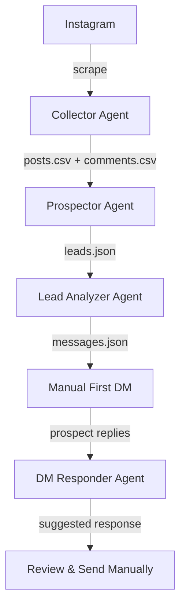

# Instagram Lead Engine - Agent Documentation

**For OpenCode AI Assistant**: This document explains the architecture, coding patterns, and conventions used in this project to help you understand and contribute effectively.

---

## Table of Contents

1. [Project Overview](#project-overview)
2. [Architecture & Design Patterns](#architecture--design-patterns)
3. [Coding Conventions](#coding-conventions)
4. [Individual Agents](#individual-agents)
5. [Database Schema](#database-schema)
6. [Integration Guide](#integration-guide)

---

## Project Overview

The Instagram Lead Engine is a **modular multi-agent system** for ethical Instagram lead generation. Each agent is:

- **Completely independent**: Own CLI, tests, and logic
- **Composable**: Part of a pipeline
- **Production-ready**: Error handling, validation, and safety features

### Tech Stack

- **Runtime**: Node.js 18+
- **Module System**: ESM (ES Modules) - `import/export` syntax
- **CLI Framework**: Commander.js for argument parsing
- **Browser Automation**: Playwright (Collector & Outreach)
- **Database**: SQLite (Shared via `better-sqlite3`)
- **Testing**: Node.js native test runner

---

## Architecture & Design Patterns

### 1. Agent Independence Pattern

Each agent follows this structure:

```
agents/[agent-name]/
├── bin/
│   └── run.js          # CLI entry point
├── src/
│   ├── index.js        # Main agent logic
│   ├── config.js       # Configuration constants
│   └── utils.js        # Helper functions
├── tests/
│   └── [agent].test.js # Unit tests
├── package.json        # Dependencies
└── README.md           # Agent-specific documentation
```

### 2. Data Flow Pattern (Shared Database)

Agents communicate primarily through a **Shared SQLite Database**:

```
[Collector] → writes to → [SQLite DB (leads table)]
                                ↓
[Outreach] → reads 'new' → sends DM → updates to 'contacted'
                                ↓
[DM Responder] → reads conversation → suggests reply
```

*Note: Some agents still produce intermediate CSV/JSON files for debugging or backup, but the source of truth is the Database.*

### 3. Error Handling Pattern

All agents follow consistent error handling:

```javascript
// Exit codes
process.exit(0);  // Success
process.exit(1);  // User error (bad params, missing files)
process.exit(2);  // System error (network, parsing)

// Error logging
console.error('ERROR:', message);  // To stderr
console.log('INFO:', message);     // To stdout
```

---

## Coding Conventions

### JavaScript Style

- ✅ Use ESM: `import/export`
- ✅ Use `async/await`
- ✅ Named functions for better stack traces
- ✅ Arrow functions for short callbacks

### Naming Conventions

**Variables & Functions**: camelCase
```javascript
const maxComments = 100;
function extractPainPoints() {}
```

**Constants**: UPPER_SNAKE_CASE
```javascript
const MAX_RETRIES = 3;
const API_ENDPOINT = 'https://api.example.com';
```

**Classes**: PascalCase
```javascript
class StateMachine {}
```

**Files**: kebab-case.js
```
scrape-post.js
state-machine.js
utils.js
```

**Exported Objects**: PascalCase for singletons
```javascript
export const CONFIG = { ... };
export const WARMTH = { ... };
```

### Code Structure

**Imports Order**:
```javascript
// 1. Node built-ins
import { readFileSync } from 'fs';
import { join } from 'path';

// 2. External dependencies
import { chromium } from 'playwright';
import { Command } from 'commander';

// 3. Internal modules
import { CONFIG } from './config.js';
import { sanitize } from './utils.js';

// 4. Shared modules
import { validators } from '../../shared/validators.js';
```

**Function Organization**:
```javascript
// 1. Main exported functions
export async function mainFunction() {}

// 2. Helper functions (not exported)
function helperFunction() {}
function anotherHelper() {}

// 3. Utility functions at bottom
function sortByDate() {}
function formatOutput() {}
```

### Comments & Documentation

**Use JSDoc for public functions**:
```javascript
/**
 * Generate response for a conversation
 * 
 * @param {Object} params
 * @param {Array} params.conversationHistory - Array of {role, text} objects
 * @param {Object} params.leadContext - Optional lead data from prospector
 * @returns {Promise<Object>} Response object with next_message, stage, reasoning
 */
export async function generateResponse({ conversationHistory, leadContext }) {
  // Implementation
}
```

**Inline comments for complex logic**:
```javascript
// FIX NOTE: Instagram may change selectors - see prompts/selector_notes.md
const SELECTORS = {
  POST_LINK: 'article a[href*="/p/"]'
};

// Wait random delay to avoid rate limits (3-7 seconds)
await page.waitForTimeout(randomDelay());
```

### File Handling

**Use async file operations**:
```javascript
import { readFile, writeFile } from 'fs/promises';

// ✅ Good
const data = await readFile('file.json', 'utf-8');

// ❌ Bad
const data = readFileSync('file.json', 'utf-8');
```

**Always handle errors**:
```javascript
try {
  const data = await readFile('file.json', 'utf-8');
  return JSON.parse(data);
} catch (error) {
  if (error.code === 'ENOENT') {
    console.error('ERROR: File not found:', error.path);
    process.exit(1);
  }
  throw error;
}
```

---

## Individual Agents

### 1. Collector Agent

**Purpose**: Discover Instagram posts and scrape comments from hashtags and competitor profiles.

#### Features
- Hashtag & Profile post discovery
- Comment extraction with metadata
    "objections_likely": ["string"],
    "best_approach": "string"
  }
]
```

### messages.json

**Structure**:
```json
{
  "persona_summary": {
    "common_pain_points": ["string"],
    "common_goals": ["string"],
    "demographic_insights": "string",
    "best_hooks": ["string"]
  },
  "top_prospects": [
    {
      "username": "string",
      "messages": [
        {
          "angle": "string",
          "script": "string",
          "purpose": "rapport|pain_point|cta"
        }
      ]
    }
  ]
}
```

### conversation_history.json

**Structure**:
```json
[
  {
    "role": "user|assistant",
    "text": "string"
  }
]
```

### 3. DM Responder Agent

**Purpose**: Manage ongoing conversations and initiate contact with new followers.

#### Features
- **Conversation State Detection**: Automatically tracks the stage of the lead.
- **Inbox Scanner**: Checks for new unread messages and suggests replies.
- **Follower Watcher (New)**: Welcomes new followers via notifications.
- **Follow-up Agent (New)**: Re-engages leads who stopped replying after 48h.
- **AI Name Extraction**: Uses LLM to find real names in bios for better personalization.

---

## Integration Guide

### Full Workflow



### Step-by-Step Integration

**1. Data Collection**
```bash
cd agents/collector
node bin/run.js --mode both --hashtags fitness --profiles competitor
```

**2. Lead Qualification**
```bash
cd agents/prospector
node bin/run.js -i ../collector/output/comments.csv -o leads.json
```

**3. Strategic Analysis**
```bash
cd agents/lead-analyzer
node bin/run.js -i ../prospector/leads.json -o messages.json --top 5
```

**4. Manual Outreach**
- Review `messages.json`
- Manually send first DM to top prospects
- DO NOT automate this step

**5. Conversation Management**
```bash
cd agents/dmresponder
node bin/run.js --interactive
# Paste prospect's reply, get suggested response
```

**6. Content Creation (Optional)**
```bash
cd agents/message-generator
node bin/run.js --niche "fitness" --pain-points "consistency" --count 30
```

### Automation Considerations

**Safe to Automate**:
- ✅ Data collection (with rate limits)
- ✅ Lead classification
- ✅ Analysis and scoring
- ✅ Response generation (for review)

**NEVER Automate**:
- ❌ First message sending
- ❌ DM replies without human review
- ❌ Any outreach without personalization

### Error Handling

All agents follow consistent error handling:

- Exit code 0: Success
- Exit code 1: User error (invalid params, missing files)
- Exit code 2: System error (network, parsing)
- Errors logged to stderr
- Debug mode available via `DEBUG=true` env var

### Testing Integration

```bash
# Test each agent independently
cd agents/collector && npm test
cd agents/dmresponder && npm test
# etc.

# Test data flow with sample files
cd agents/prospector
node bin/run.js -i ../collector/samples/comments.csv -o test_leads.json

cd agents/lead-analyzer
node bin/run.js -i test_leads.json -o test_messages.json
```

---

## Support & Resources

- **Individual Agent READMEs**: Each agent has detailed documentation
- **Sample Files**: Check `samples/` folders for examples
- **Schemas**: See `schemas/` for data validation
- **Troubleshooting**: Check each agent's README

**Questions?** Open an issue on GitHub.

---

**Last Updated**: 2024-01-15  
**Version**: 1.0.0
