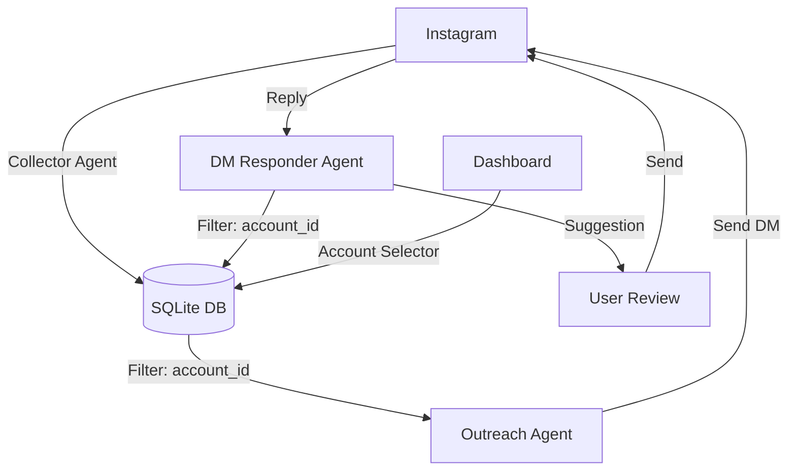

# Instagram Lead Engine

**A complete multi-agent system for ethical Instagram lead generation and relationship building.**

## 🎯 Overview

The Instagram Lead Engine is a production-ready, modular system of independent agents designed to help coaches, consultants, and service providers find and connect with qualified prospects on Instagram.

It uses a **shared SQLite database** to track leads through the entire lifecycle: from discovery to initial outreach to conversation handling.

## 🏗️ Architecture

This system contains **3 core agents**:

### 1. **Collector Agent** (Data Collection)
Discovers posts and scrapes comments from hashtags and competitor profiles.
- ✅ Hashtag & profile discovery
- ✅ Comment scraping with metadata
- ✅ Engagement scoring & qualification
- ✅ **Output**: Saves qualified leads to SQLite database

### 2. **Outreach Agent** (First Contact)
Identifies top prospects and sends personalized first messages.
- ✅ Filters leads by engagement score
- ✅ Generates personalized messages based on context
- ✅ Handles manual/automated sending flow (preview mode available)
- ✅ **Output**: Updates lead status, logs sent messages

### 3. **DM Responder Agent** (Conversation AI)
Generates contextual follow-up messages for ongoing conversations.
- ✅ Analyzes conversation history
- ✅ Suggests empathetic, qualified responses
- ✅ Handles objections and value propositions
- ✅ **Output**: Suggests replies, tracks conversation state

---

## 🚀 Quick Start (5 Minutes)

### 1. Install & Setup

```bash
# Install dependencies for all agents
cd agents/collector && npm install
cd ../outreach && npm install
cd ../dmresponder && npm install

# Install browser (required for Collector/Outreach)
npx playwright install chromium
```

### 2. Connect Your Account

The system uses a **real browser** (Playwright) to interact with Instagram safely.
On the first run (for each profile), you will need to log in manually. The session will be saved for future runs.

### 3. Multi-Account Support

You can manage multiple Instagram accounts independently. Data is isolated by `account_id` in the database, and browser sessions are kept in separate folders.

Always use the `--profile` flag to specify which account you are using:

```bash
# Collect leads for 'fitness_coach'
npm run scrape -- --profile fitness_coach -t gym

# Run outreach for 'fitness_coach'
npm run outreach -- --profile fitness_coach --simple

# Respond to NEW replies only for 'fitness_coach'
npm run reply:replied -- --profile fitness_coach

# Respond to all active conversations for 'fitness_coach'
npm run reply -- --profile fitness_coach
```

### 4. Run Your First Scrape (Collector)

```bash
npm run scrape -- --hashtags fitness --target-prospects 20
```
*This will find posts, scrape comments, score prospects, and save them to the database.*

### 4. Send Initial DMs (Outreach)

```bash
cd ../outreach
# Preview messages first
node bin/run.js --mode preview --limit 5

# Send messages (opens browser for manual confirmation by default)
node bin/run.js --mode send --limit 5
```

### 5. Respond to Replies (DM Responder)

```bash
cd ../dmresponder
# Interactive mode to generate replies
node bin/run.js --interactive
```

### 6. Tools & Monitoring

#### 📊 Lead Dashboard
Monitor leads, track conversions, and switch between accounts in real-time.

```bash
npm run ui
```
- **Access**: http://localhost:3000
- **Features**: Interactive stats, **Account Selector**, bulk actions, and live logs.

#### 🗄️ Database Admin
Explore the SQLite database directly with a web interface.

```bash
npm run db:admin
```
- **Access**: http://localhost:8081

#### 💾 Sauvegarde & Restauration

Le système est configuré pour être **ultra-sécurisé** : une sauvegarde (locale + Google Drive) est lancée **automatiquement** après chaque exécution réussie des agents.

```bash
# Sauvegarder manuellement (Cloud)
npm run backup:remote

# Restaurer (Interface interactive)
npm run restore         # Depuis local
npm run restore:remote  # Depuis Google Drive

# Réinitialiser la base de données (SUPPRIME TOUT)
rm agents/collector/permanent-data/leads.db*
```

**Configuration Google Drive (via rclone) :**
```bash
brew install rclone
rclone config  # Créer un remote nommé "gdrive"
```

---

## 📊 Data Flow (SQLite)

The system is built around a shared **SQLite database** located in `agents/collector/data/instagram.db` (by default).



1.  **Collector**: Ingests raw data -> `leads` table (status: `new`).
2.  **Outreach**: Reads `new` leads -> updates to `outreach`.
3.  **DM Responder**: Detects prospect reply -> updates to `conversation` -> suggests next move.

---

## 🔒 Safety & Compliance

### Manual Login Required
- All scraping/sending requires manual Instagram login via the headful browser.
- Credentials are stored locally in `.env` only.

### Anti-Detection
- Headful browser (not headless)
- Randomized delays (3-7 seconds)
- Stops on challenge detection
- Human-like scrolling behavior

### Ethical Use
- ❌ **NEVER** spam or send unsolicited mass DMs.
- ❌ **NEVER** automate outreach without human review.
- ✅ **ALWAYS** personalize messages and provide value.

---

## 📁 Project Structure

```
instagram-lead-engine/
├── agents/
│   ├── collector/           # Discovery & Scoring (holds the DB)
│   ├── outreach/            # First Message & Sending
│   └── dmresponder/         # Conversation AI
├── shared/                  # Shared utilities (DB connection, validators)
├── AGENTS.md                # Detailed agent documentation
└── README.md                # This file
```

## 📚 Documentation

- **[AGENTS.md](./AGENTS.md)**: Detailed technical documentation for all agents.
- **[Collector README](./agents/collector/README.md)**
- **[Outreach README](./agents/outreach/README.md)**
- **[DM Responder README](./agents/dmresponder/README.md)**

---

## ⚖️ Disclaimer

This system is provided for **educational purposes only**. Users are responsible for complying with Instagram's Terms of Service and applicable laws. The authors assume no liability for misuse, account restrictions, or damages.

**Built with ❤️ for ethical lead generation**
